# Aplicativo móvel - Smart Home Control

##Visão Geral
O SmartHomeControl é um aplicativo móvel projetado para controlar e monitorar sensores e atuadores conectados a um ESP32, utilizando comunicação via MQTT. O aplicativo oferece uma plataforma para gerenciamento completo da automação residencial, onde o usuário pode configurar dispositivos, monitorar o ambiente em tempo real, definir alertas e personalizar modos de operação, como "Férias", "Trabalho" e "Em Casa". A aplicação também inclui uma interface de login para garantir a segurança dos dados e das configurações.

## 🌐 Ecossistema do Projeto

Este repositório é parte de um sistema maior de automação residencial que inclui:

- 📱 **Aplicativo Mobile** (Flutter): Este repositório
- 🖥️ **Backend** (C#): [TISM_MQTT](https://github.com/Karosso/TISM_MQTT)
- 🔥 **Firebase**: Armazenamento de dados e autenticação
- 🔌 **ESP32** (C++): [smh_esp](https://github.com/Karosso/smh_esp)


## Funcionalidades

1. **Monitoramento de Sensores:**
    - **Exibição em Tempo Real:** Os dados coletados pelos sensores conectados ao ESP32 são exibidos em tempo real, permitindo ao usuário acompanhar o status de diferentes aspectos do ambiente.
    - **Histórico de Dados:** Gráficos e históricos dos dados para cada sensor, permitindo a análise e o acompanhamento ao longo do tempo.
2. **Controle de Atuadores:**
    - **Ação Direta:** O usuário pode ativar ou desativar atuadores diretamente pelo app, como ligar/desligar lâmpadas ou abrir/fechar portões.
    - **Automação:** Programação de ações automáticas baseadas nas condições dos sensores, como acender as luzes ao detectar presença.
3. **Configuração de Alertas:**
    - **Definição de Limites:** O usuário pode definir alertas para quando os valores dos sensores atingirem limites pré-estabelecidos, como alta temperatura ou presença de fumaça.
    - **Notificações:** Notificações push são enviadas para alertas críticos, garantindo que o usuário seja informado imediatamente.
4. **Modos de Operação Personalizados:**
    - **Modos Predefinidos:** Modos como "Férias", "Trabalho" e "Em Casa" podem ser ativados, cada um com comportamentos específicos para os sensores e atuadores.
    - **Personalização:** O usuário pode adicionar, editar e remover modos personalizados, definindo ações automáticas e horários específicos para cada modo.
5. **Gerenciamento de Dispositivos:**
    - **Adição e Remoção:** O aplicativo permite adicionar e remover sensores e atuadores, configurando parâmetros MQTT para cada dispositivo.
    - **Configuração Fácil:** Interface intuitiva para configurar e nomear dispositivos, facilitando a organização e o controle.
6. **Autenticação de Usuários:**
    - **Segurança:** Tela de login para garantir acesso seguro às configurações e aos dispositivos conectados.
    - **Múltiplos Usuários:** Suporte a diferentes níveis de acesso para múltiplos usuários.
7. **Painel de Controle Central:**
    - **Visão Geral:** Exibição de uma visão geral dos dispositivos conectados e do status atual dos modos e alertas.
    - **Acesso Rápido:** Facilita a ativação/desativação de modos e a visualização de alertas ativos.

## Exemplos de sensores e atuadores que poderão ser utilizados

1. **Controle de Portão Eletrônico:**
    - **Sensor:** Sensor Magnético Reed Switch, que detecta se o portão está aberto ou fechado.
    - **Atuador:** Relé Controlado por Wi-Fi, que aciona o motor para abrir ou fechar o portão.
2. **Monitoramento de Portas e Janelas:**
    - **Sensor:** Sensor de Contato Magnético, utilizado para detectar a abertura e fechamento de portas e janelas.
3. **Controle de Iluminação:**
    - **Sensor:** Sensor de Luminosidade (LDR), que mede o nível de luz ambiente e automatiza as lâmpadas.
    - **Atuador:** Relé ou Módulo de Dimmer, para ligar, desligar ou ajustar a intensidade das lâmpadas.
4. **Sensores de Presença:**
    - **Sensor:** Sensor PIR (Infravermelho Passivo), capaz de identificar a presença de pessoas e animais.
    - **Aplicação:** Pode acionar lâmpadas automaticamente ou ativar alarmes quando detectar movimento.
5. **Controle de Temperatura e Umidade:**
    - **Sensor:** DHT11/DHT22, que monitora temperatura e umidade do ambiente.
    - **Atuador:** Relé para Controle de Aquecedores ou Ventiladores, ativando ou desativando com base nos valores detectados.
6. **Sensores de Fumaça/Gás:**
    - **Sensor:** MQ-2, que detecta a presença de fumaça ou gases perigosos.
    - **Atuador:** Sistema de Alarme ou Ventilação Automática, que pode ser ativado em caso de detecção de gases.
7. **Monitoramento de Consumo de Energia:**
    - **Sensor:** Sensor de Corrente (ACS712), que monitora o consumo de energia de dispositivos conectados.
    - **Atuador:** Relé para Desligamento Automático, que desliga equipamentos que ultrapassem um limite de consumo.

## Prototipação

### **1. Tela de Login**

- **Funcionalidades:**
    - **Campo de E-mail:** Campo para inserção do e-mail do usuário.
    - **Campo de Senha:** Campo para inserção da senha.
    - **Botão "Entrar":** Realiza a autenticação e acessa o dashboard.
    - **Link "Esqueceu sua senha?":** Redireciona para a recuperação de senha.
    - **Botão "Registrar-se":** Direciona para a tela de registro de novos usuários.

    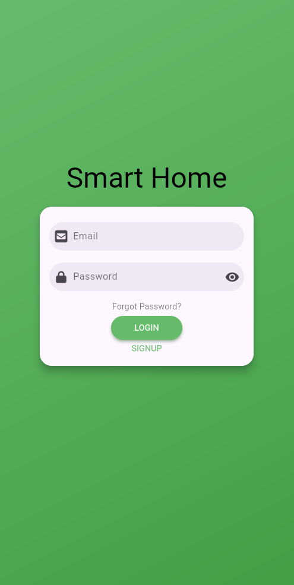

### **2. Tela Inicial (Dashboard)**

- **Funcionalidades:**
    - **Cabeçalho:** Exibe o nome do aplicativo e ícone de perfil do usuário.
    - **Visão Geral dos Sensores:** Mostra o status em tempo real dos sensores, como temperatura, portão, presença, etc.

    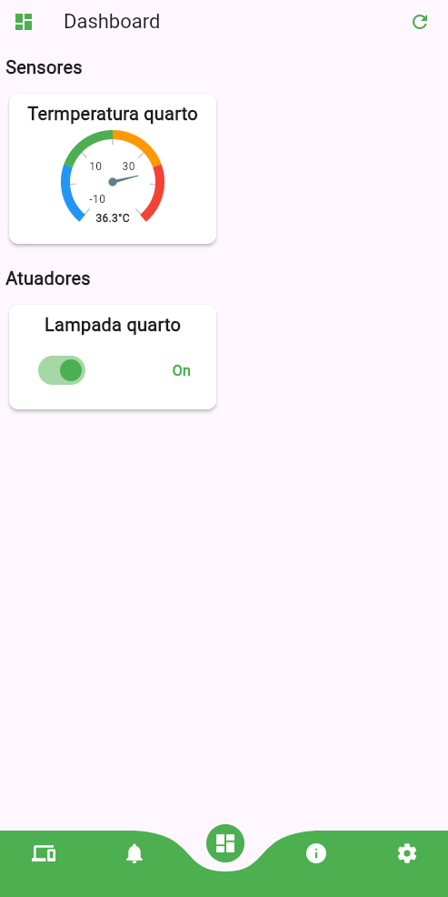

### **3. Tela de dispositivos**

- **Funcionalidades:**
    - **Lista de Dispositivos:** Exibe todos os sensores e atuadores conectados, como reed switches, sensores de luminosidade, sensores de presença, relés para controle de lâmpadas, portões, etc., com opções para ligar/desligar.
    - **Botão "Adicionar Sensor":** Permite adicionar novos sensores ao sistema.
    - **Botão "Remover Sensor":** Permite remover sensores ao sistema.
    - **Pop-up "Confirmar remoção":** Confirmar remoção do sensor.
    - **Botão "Adicionar Atuador":** Permite adicionar novos atuadores ao sistema.
    - **Botão "Remover Atuador":** Permite remover atuadores ao sistema.
    - **Pop-up "Confirmar remoção":** Confirmar remoção do atuador.

    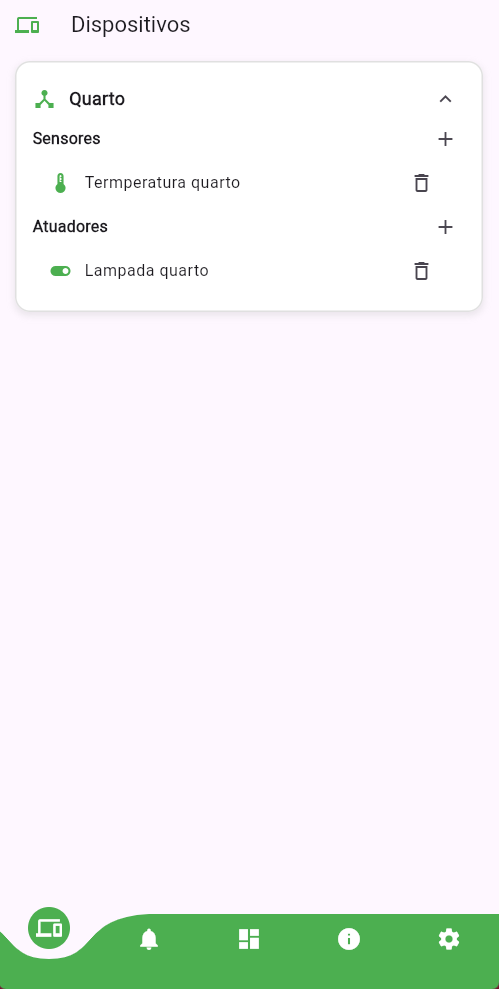
    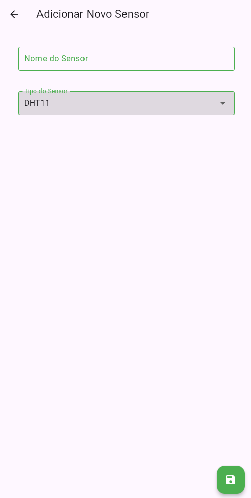
    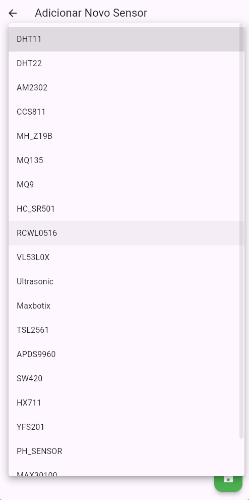
    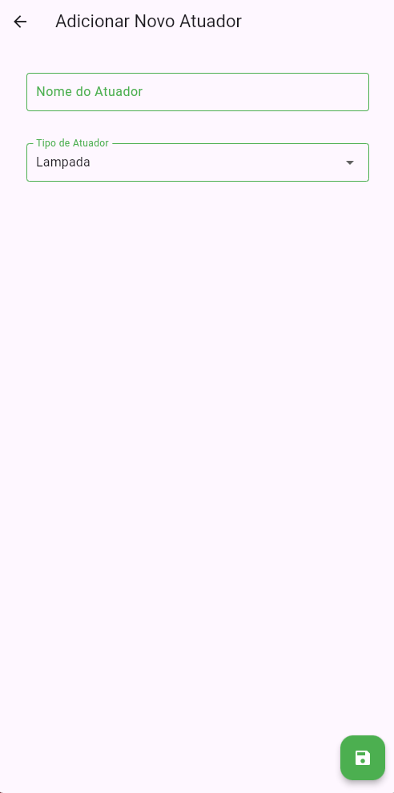
    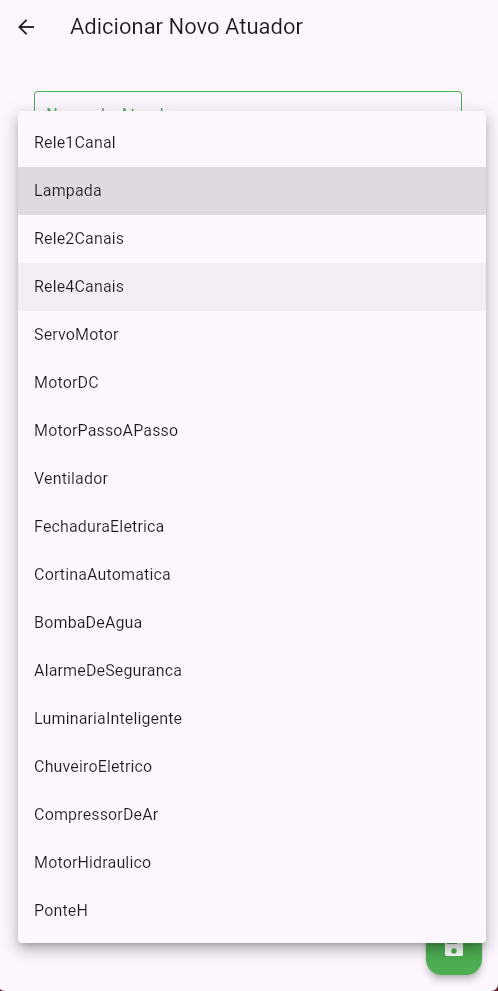
    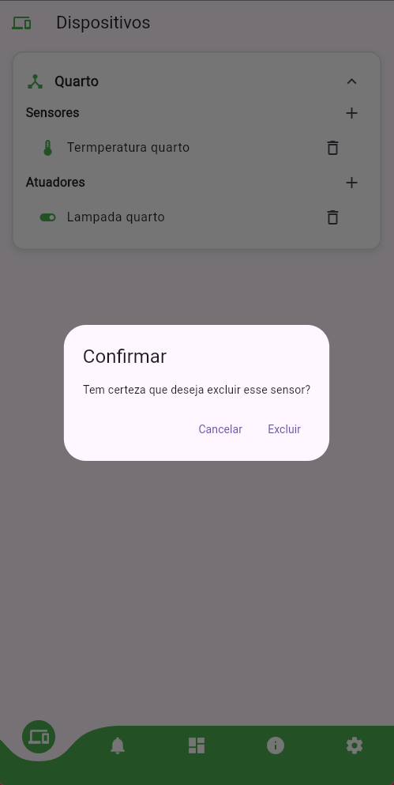

### **4. Tela de Alertas**

- **Funcionalidades:**
    - **Lista de Alertas:** Exibe a lista de alertas configurados para determinados valores dos sensores.
    - **Botão "Adicionar Alerta":** Permite adicionar novos alertas, um por sensor.

    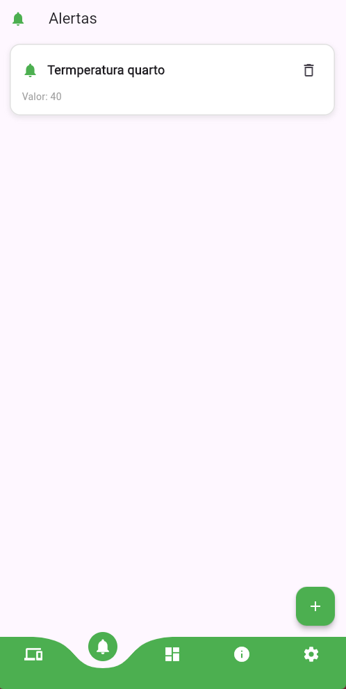
    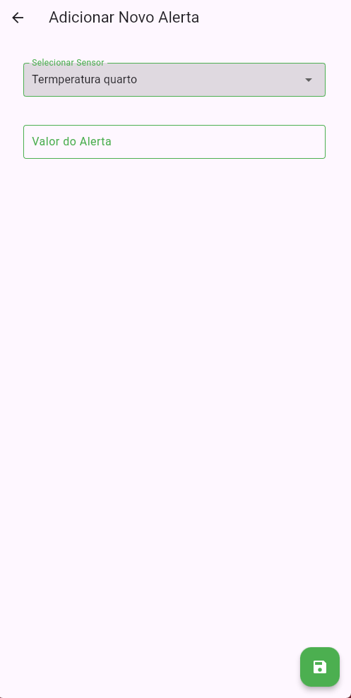

### **5. Tela de Guia do Usuário**

- **Funcionalidades:**
    - **Informações:** Informações de uso do sistema, inclusão de sensores, atuadores e ESP32, e como utilizar o aplicativo

    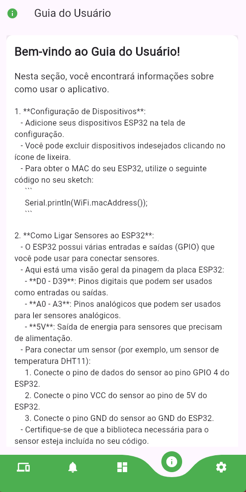

### **6. Tela de Configurações**

- **Funcionalidades:**
    - **Lista de ESP32:** Mostra todos os ESP32 cadastrados.
    - **Botão LogOut:** Permite o usuário fazer o log-out do sistema.
    - **Botão "Adicionar ESP32":** Permite adicionar novos ESP32 ao sistema.
    - **Botão "Remover ESP32":** Permite remover ESP32 do sistema.

    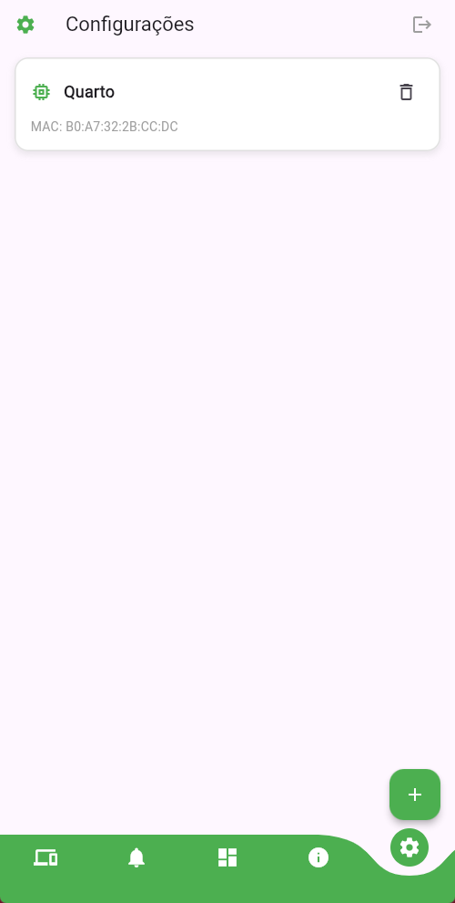
    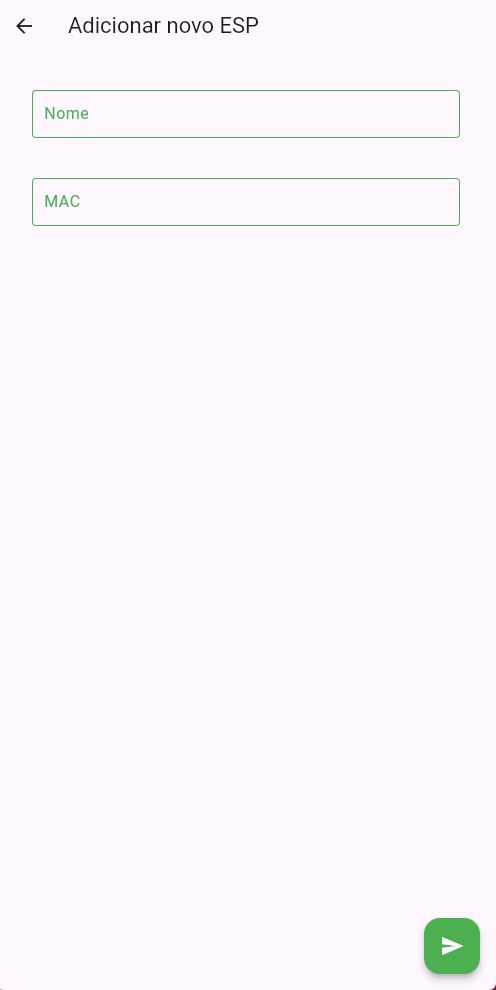
    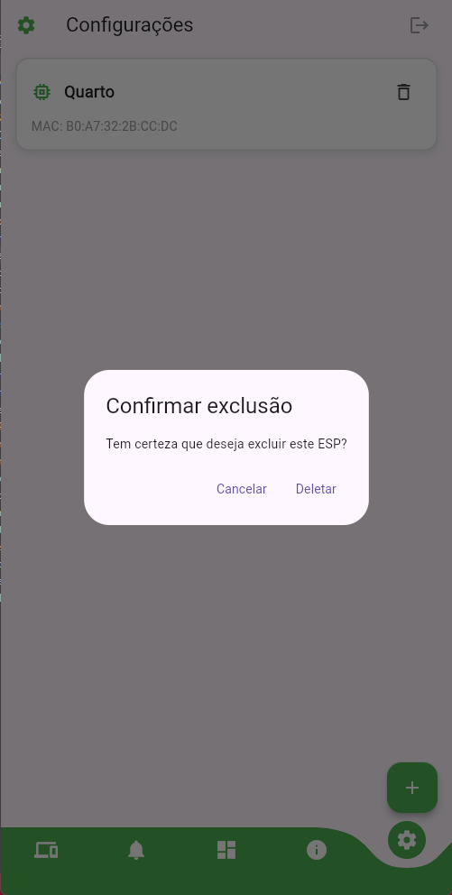

## Como Contribuir

1. Faça um Fork do projeto
2. Crie uma Branch para sua Feature (`git checkout -b feature/AmazingFeature`)
3. Faça o Commit de suas mudanças (`git commit -m 'Add some AmazingFeature'`)
4. Faça o Push para a Branch (`git push origin feature/AmazingFeature`)
5. Abra um Pull Request

## Licença
Este projeto está licenciado sob a Licença MIT - veja abaixo o texto completo:

```
MIT License

Copyright (c) 2024 Oscar Dias (https://github.com/Karosso)
Copyright (c) 2024 Bruno Reis (https://github.com/brunohreis)

Permission is hereby granted, free of charge, to any person obtaining a copy
of this software and associated documentation files (the "Software"), to deal
in the Software without restriction, including without limitation the rights
to use, copy, modify, merge, publish, distribute, sublicense, and/or sell
copies of the Software, and to permit persons to whom the Software is
furnished to do so, subject to the following conditions:

The above copyright notice and this permission notice shall be included in all
copies or substantial portions of the Software.

THE SOFTWARE IS PROVIDED "AS IS", WITHOUT WARRANTY OF ANY KIND, EXPRESS OR
IMPLIED, INCLUDING BUT NOT LIMITED TO THE WARRANTIES OF MERCHANTABILITY,
FITNESS FOR A PARTICULAR PURPOSE AND NONINFRINGEMENT. IN NO EVENT SHALL THE
AUTHORS OR COPYRIGHT HOLDERS BE LIABLE FOR ANY CLAIM, DAMAGES OR OTHER
LIABILITY, WHETHER IN AN ACTION OF CONTRACT, TORT OR OTHERWISE, ARISING FROM,
OUT OF OR IN CONNECTION WITH THE SOFTWARE OR THE USE OR OTHER DEALINGS IN THE
SOFTWARE.
```

## Suporte

- Em caso de dúvidas ou problemas, abra uma issue no repositório do projeto
- Para questões relacionadas ao aplicativo mobile, visite [smart_home_control](https://github.com/Karosso/smart_home_control)
- Para questões relacionadas ao ESP32, visite [smh_esp](https://github.com/Karosso/smh_esp)
